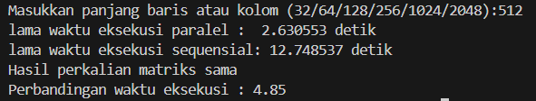

### Go
- **Input dan Pembacaan Matriks:** Program meminta pengguna untuk memasukkan ukuran matriks, kemudian membaca dua matriks dari file dengan nama yang sesuai dengan ukuran tersebut.
- **Perkalian Matriks:** Terdapat dua metode untuk mengalikan matriks: secara sekuensial dan paralel. Pada pendekatan paralel, setiap elemen hasil perkalian dihitung dalam goroutine terpisah, yang disinkronisasi menggunakan `sync.WaitGroup`.
- **Perbandingan:** Hasil dari kedua metode dibandingkan untuk memastikan konsistensi, dan waktu eksekusi antara metode paralel dan sekuensial dibandingkan.

### Python
- **Input dan Pembacaan Matriks:** Pengguna diminta untuk memasukkan ukuran matriks. Dua matriks dibaca dari file dengan format yang diharapkan.
- **Perkalian Matriks:** Program menggunakan multiprocessing untuk melakukan perkalian matriks secara paralel. Setiap proses mengerjakan bagian dari matriks hasil, yang disimpan dalam shared memory.
- **Perbandingan:** Hasil dari perkalian matriks paralel dan sekuensial dibandingkan, dan waktu eksekusi kedua metode tersebut dibandingkan untuk melihat efisiensi.

### Rust
- **Input dan Pembacaan Matriks:** Pengguna diminta untuk memasukkan ukuran matriks, dan kemudian matriks dibaca dari file.
- **Perkalian Matriks:** Program menggunakan `rayon` untuk melakukan perkalian matriks secara paralel, di mana elemen-elemen hasil dihitung secara bersamaan. Pendekatan sekuensial juga diimplementasikan.
- **Perbandingan:** Hasil dari metode paralel dan sekuensial dibandingkan, dan waktu eksekusi kedua metode dihitung serta dibandingkan.

### Java
- **Input Pengguna:** Program meminta pengguna untuk memasukkan nama file yang berisi matriks serta jumlah prosesor yang akan digunakan.
- **Membaca Matriks:** Program membaca dua matriks dari file teks dengan menggunakan method `readMatrix`.
- **Perkalian Matriks Secara Sekuensial:** Program mengalikan kedua matriks secara sekuensial menggunakan method `multiply`.
- **Perkalian Matriks Secara Paralel:** Program mengalikan kedua matriks secara paralel menggunakan method `multiply_parallel`, yang memanfaatkan `IntStream` untuk menjalankan operasi secara paralel.
- **Perbandingan Hasil:** Program membandingkan hasil perkalian matriks dari kedua metode untuk memastikan bahwa hasilnya sama, dan mencetak waktu eksekusi dari kedua metode.

### Hasil Test Case
## Python
# 32x32

# 64x64

# 128x128

# 256x256

# 512x512

# 1024x1024

# 2048x2048

## Rust
# 32x32

# 64x64

# 128x128

# 256x256

# 512x512

# 1024x1024

# 2048x2048

## Java
# 32x32

# 64x64

# 128x128

# 256x256

# 512x512

# 1024x1024

# 2048x2048

## Go
# 32x32

# 64x64

# 128x128

# 256x256

# 512x512

# 1024x1024

# 2048x2048

